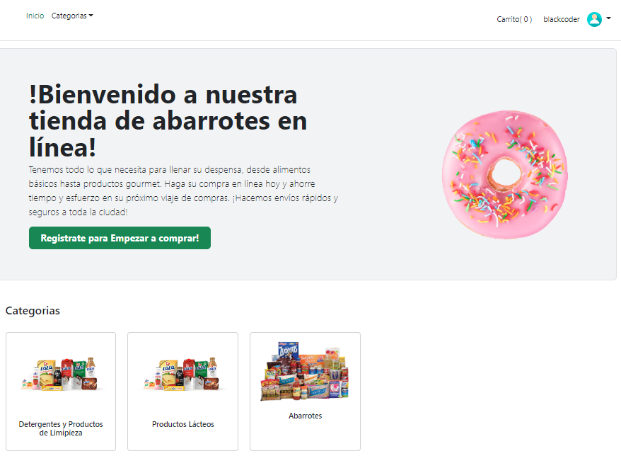
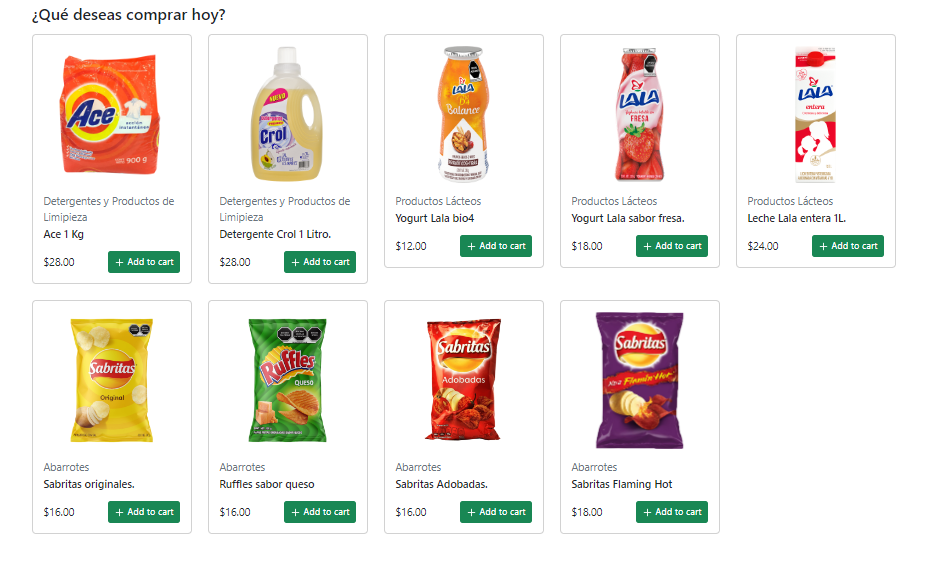
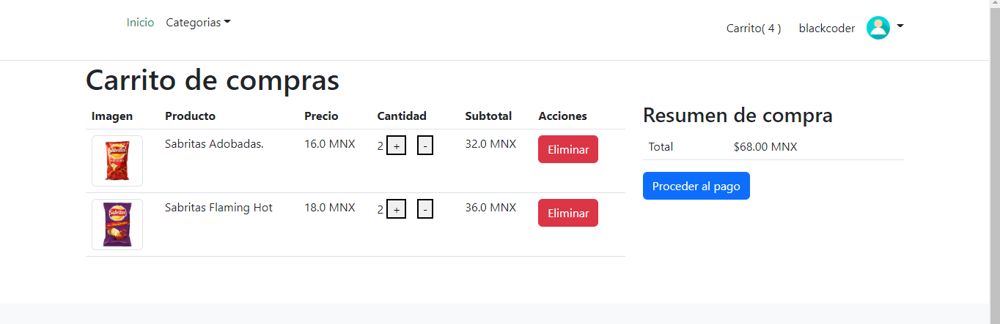
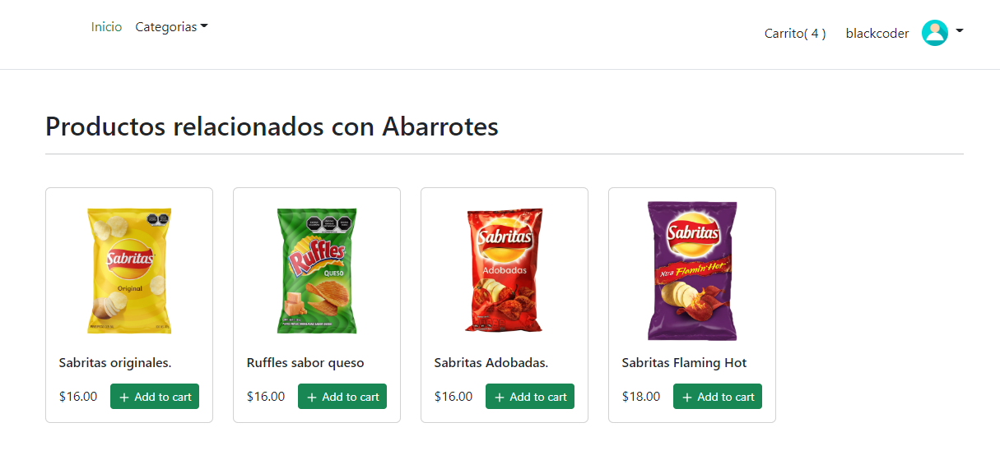
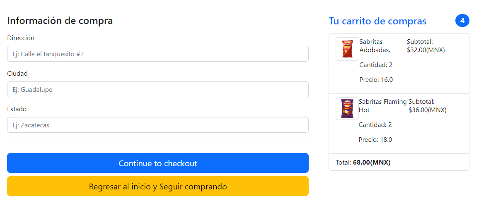
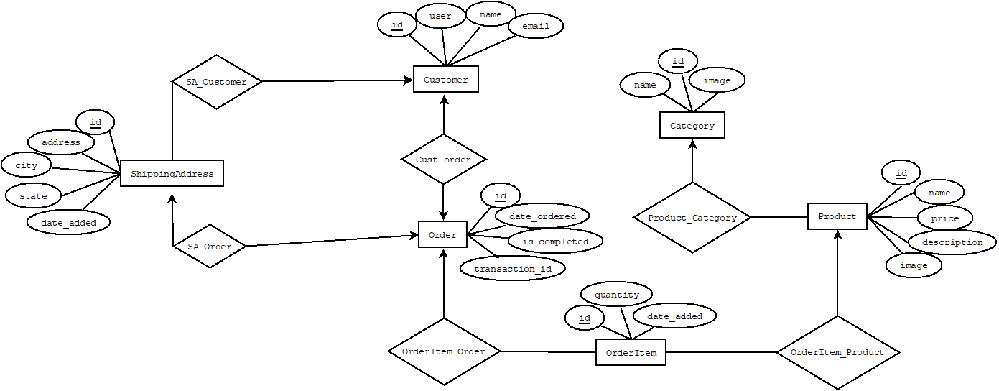

# DjangoE-commerce
The repository's objective is to show a personal project of e-commerce built utilizing Django as backend technology and Bootstrap5 as frontend technology. It's important to mention that the frontend design is not responsive.

## Preview of the project
The home page is composed of the most relevant categories of the store and general products. Here are some pictures of the home page.

The shopping cart works utilizing session in Django so it's possible to add products to the cart even if the user is not logged in. Once the user is logged in the shopping cart of the user is saved in the database.

When a particular category is selected the app is going to show the products of that category.

The checkout page can only be seen by authenticated users, for now, the app is not integrated with any payment tool.

## Database design

